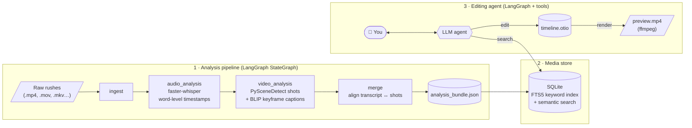

# 🎬 Video Editor Agent

**Edit video by talking to an agent.** Drop your raw footage in a folder, let the pipeline watch and listen to it, then ask for a rough cut in plain language:

> *"Find the shot where she talks about the blue sky, put it at the start, then add the wide shot of the beach after it and render a preview."*

The agent searches your rushes by meaning or by keyword, places shots on an [OpenTimelineIO](https://opentimelineio.readthedocs.io/) timeline, cuts clips, and renders an MP4 preview with ffmpeg. Everything runs locally except the LLM call.

Built with **LangGraph**, **faster-whisper**, **PySceneDetect**, **BLIP**, **SentenceTransformers**, **SQLite FTS5** and **OpenTimelineIO**.

---

## How it works

The project is split into two LangGraph graphs: an **offline analysis pipeline** that turns raw footage into structured, searchable data, and a **conversational agent** that edits a timeline with tools.



1. **Ingest** finds every video file in the input folder.
2. **Audio analysis** transcribes each rush with faster-whisper (voice-activity filtering, word-level timestamps).
3. **Video analysis** detects shot boundaries with PySceneDetect, extracts a keyframe per shot and (optionally) captions it with BLIP.
4. **Merge** aligns transcript segments with the shots they overlap, producing "timeline atoms": one shot, its timecodes, what is said and what is seen.
5. **Media store** loads the bundle into SQLite, with an FTS5 index for exact keyword queries and SentenceTransformer embeddings (`all-mpnet-base-v2`) for semantic search over the transcript.
6. **Editing agent** is a tool-calling LLM agent that combines search and timeline tools to answer requests and build the edit. It always answers with shot IDs and timecodes.

## Agent tools

| Tool | What it does |
|---|---|
| `semantic_clip_search` | Finds shots whose transcript matches a natural-language query (cosine similarity on embeddings). |
| `keyword_clip_search` | Exact search with SQLite FTS5 syntax (`AND`, `OR`, `NEAR`…). |
| `list_analyzed_shots` | Browses the shot catalog, optionally filtered by asset. |
| `lookup_segment_context` | Maps a transcript segment back to its shot and timecodes. |
| `initialize_timeline` | Creates (or resets) an empty OTIO timeline. |
| `insert_shot_into_timeline` | Places a shot at a given time, or appends it to the end. |
| `cut_timeline_clip` | Splits the clip under a given timestamp. |
| `describe_timeline` | Returns the current edit: clips, order and timecodes. |
| `render_timeline_preview` | Renders the timeline to MP4 with ffmpeg: rescales and pads to the largest source resolution, and falls back to silent output if a rush has no audio. |

All timeline edits are non-destructive: the source files are never touched, and the resulting `.otio` file can be opened in other OTIO-compatible tools or converted to EDL.

## Getting started

### Prerequisites

- Python 3.12 and [uv](https://github.com/astral-sh/uv) (or pip)
- `ffmpeg` and `ffprobe` on your `PATH`
- An **OpenAI** or **Azure OpenAI** API key
- Optional: a LangSmith API key for tracing

### Install

```bash
git clone https://github.com/OdakK/video_editor_agent.git
cd video_editor_agent
uv sync
cp .env.example .env   # then fill in your API keys
```

### 1. Analyze your rushes

```bash
python main.py --input-dir ./input_rushed --output-dir ./output
```

This writes to `./output`:

- `analysis_bundle.json`: the merged timeline atoms
- `audio_index.json`: transcript segments per asset
- `video_index.json`: shots, keyframes and captions per asset
- `keyframes/`: one JPEG preview per detected shot

> Whisper and BLIP are heavy. CPU works but is slow; a GPU or Apple Silicon helps a lot. You can tune the models and thresholds:
>
> ```python
> from workflows.analysis import build_analysis_workflow
> from media_analysis.audio import AudioAnalyzer
> from media_analysis.video import VideoAnalyzer
>
> workflow = build_analysis_workflow(
>     audio_analyzer=AudioAnalyzer(model_size="large-v3"),
>     video_analyzer=VideoAnalyzer(threshold=28.0, enable_captions=False),
> ).compile()
> workflow.invoke({"input_dir": "./rushes", "output_dir": "./output"})
> ```

### 2. Talk to the editor

```bash
langgraph dev --allow-blocking
```

This starts the LangGraph dev server with LangGraph Studio, where you can chat with the `agent` graph and watch every tool call. With `LANGSMITH_API_KEY` set, runs are also traced in LangSmith.

Try requests like:

- *"List all the shots from the first rush."*
- *"Find where someone says 'ciel bleu' and add that shot to the timeline."*
- *"Cut the clip at 12.5 seconds and describe the timeline."*
- *"Render a preview to preview.mp4."*

## Project structure

```
src/
├── workflows/
│   ├── analysis.py       # LangGraph analysis pipeline: ingest → audio → video → merge
│   └── agent.py          # Editing agent: LLM + tools, exposed to `langgraph dev`
├── media_analysis/
│   ├── ingest.py         # Media discovery
│   ├── audio.py          # faster-whisper transcription
│   ├── video.py          # PySceneDetect shots, keyframes, BLIP captions
│   ├── merge.py          # Transcript ↔ shot alignment
│   └── schemas.py        # Pydantic models (MediaAsset, SceneSegment, TimelineAtom…)
├── media_store/
│   └── store.py          # SQLite schema, FTS5 and semantic search
├── timeline/
│   └── manager.py        # OTIO editing and ffmpeg rendering
└── tools/
    ├── media_tools.py    # Search tools for the agent
    └── timeline_tools.py # Editing tools for the agent
main.py                   # CLI for the analysis pipeline
langgraph.json            # Graph definitions for `langgraph dev`
```

## Design choices

- **Two graphs, not one.** Analysis is slow and deterministic, and it runs once per batch of rushes. Editing is fast, interactive and LLM-driven. Keeping them separate means you never re-transcribe footage to try a new edit.
- **Timeline atoms as the shared language.** Each shot carries its timecodes, overlapping transcript and captions, so the agent reasons about *shots* instead of raw frames or audio.
- **Keyword and semantic search.** FTS5 handles exact words and names; embeddings handle "the part where they talk about the weather". The agent picks the right tool for the request.
- **OTIO as the output format.** It's an open, non-destructive timeline format, so the rough cut isn't locked into this tool.

## Limitations and roadmap

This is a working prototype, not a finished editor.

- Semantic search currently embeds the transcript on each query. Caching the embeddings in the store (or using a vector index) is the next step for large libraries.
- Captions and tags are stored but not yet included in semantic search.
- Previews render one track at a time; there are no transitions, titles or audio mixing yet.
- Next ideas: speaker diarization for speaker-aware edits, object and face detection for visual tags, and captions in the semantic index.

## License

No license has been chosen yet. Contact me if you'd like to reuse the code.
